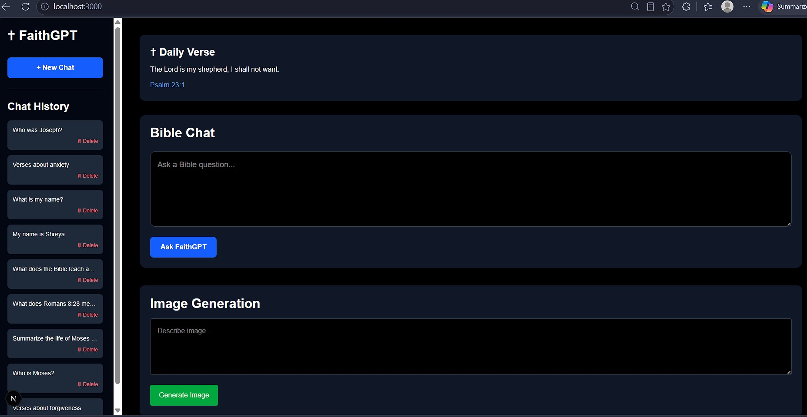
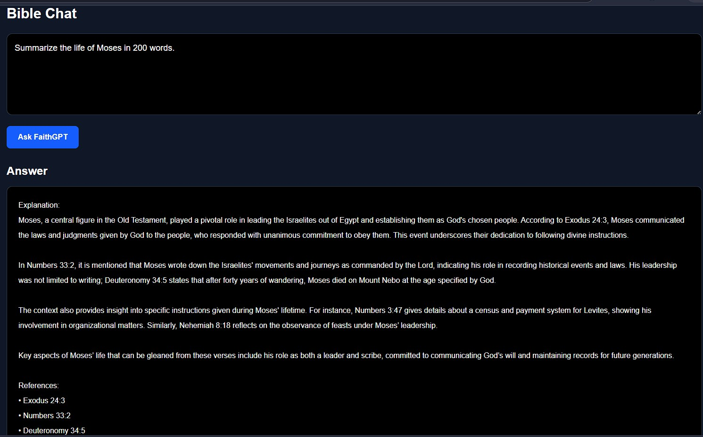
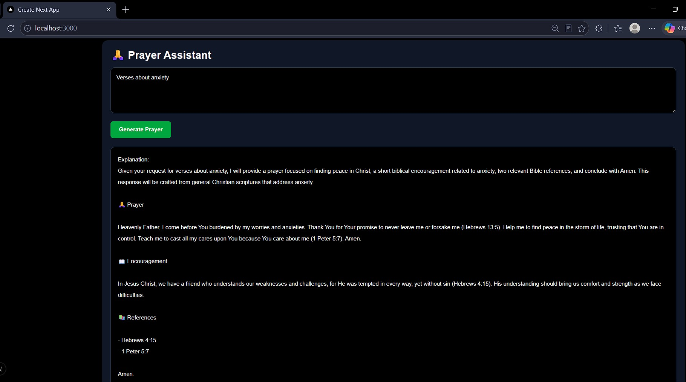
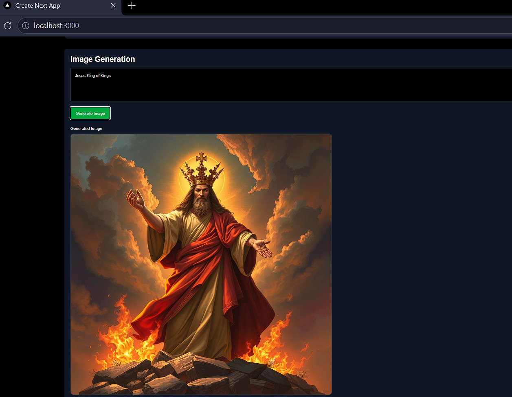

# ✝️ FaithGPT

AI-powered Christian Assistant with Bible Question Answering, Personal Memory, Prayer Generation, Daily Bible Verses, Christian Image Generation, and Chat History Management.

---

## ✨ Features

### 📖 Bible Chat (RAG)

* Scripture-grounded Bible Question Answering
* FAISS Semantic Search
* Context-based Answers
* Verse References
* Hallucination Reduction

Examples:

* Who was Joseph?
* Explain Romans 8:28
* What does the Bible teach about patience?
* Tell me about Moses

---

### 🧠 Personal Memory

FaithGPT remembers information shared by the user.

Examples:

* My name is Shreya
* I am an AI Engineer
* I am learning Artificial Intelligence

Ask later:

* What is my name?
* What do you know about me?
* What am I learning?

---

### 🙏 Prayer Assistant

Generate personalized Christian prayers.

Includes:

* Prayer
* Encouragement
* Bible References

Examples:

* Pray for my career
* Pray for my future
* Pray for my family
* Pray for anxiety

---

### 🖼 Christian Image Generation

Generate AI-powered Christian images.

Examples:

* Jesus walking on water
* Garden of Gethsemane
* Moses parting the Red Sea
* Noah's Ark at sunset
* Angel appearing to Mary

---

### ✝ Daily Bible Verse

Displays a random daily verse on application startup.

Examples:

* John 3:16
* Romans 8:28
* Philippians 4:13

---

### 🗑 Chat History

* New Chat
* History Sidebar
* Delete Individual Chats
* Persistent Storage

---

## 🏗 Architecture

User Question

↓
Next.js Frontend

↓
FastAPI Backend

↓
FAISS Retriever

↓
Bible Context

↓
Qwen 2.5 via Ollama

↓
Generated Response

---

## 🛠 Tech Stack

### Frontend

* Next.js
* React
* Tailwind CSS
* Axios

### Backend

* FastAPI
* SQLAlchemy
* SQLite
* Ollama

### AI Stack

* Qwen 2.5
* FAISS
* HuggingFace Embeddings
* LangChain
* Retrieval-Augmented Generation (RAG)

---

## 📂 Project Structure

FaithGPT/

├── backend/

│ ├── main.py

│ ├── services/

│ ├── rag/

│ ├── models/

│ └── database.py

│

├── frontend/

│ ├── src/

│ ├── app/

│ ├── components/

│ └── public/

│

├── data/

│ └── bible.csv

│

├── screenshots/

│ ├── home.png

│ ├── bible-chat.png

│ ├── memory.png

│ ├── prayer.png

│ └── image-generation.png

│

├── requirements.txt

├── README.md

└── .gitignore

---

## 🚀 Installation

### Clone Repository

git clone https://github.com/yourusername/FaithGPT.git

cd FaithGPT

---

### Backend Setup

pip install -r requirements.txt

uvicorn backend.main:app --reload

---

### Frontend Setup

cd frontend

npm install

npm run dev

---

### Install Ollama Model

ollama pull qwen2.5

ollama serve

---

## 📸 Screenshots

### Home Page

### Bible Chat

### Prayer Assistant

### Image Generation

---

## 🔮 Future Improvements

* Voice Assistant
* Bible Study Planner
* Verse Search Engine
* Multi-language Support
* User Authentication
* Devotional Generator
* Audio Prayer Generation

---

## 👩‍💻 Author

Shreya Sidabache

M.Tech Artificial Intelligence

AI Engineer | Computer Vision | Generative AI | RAG Systems

---

